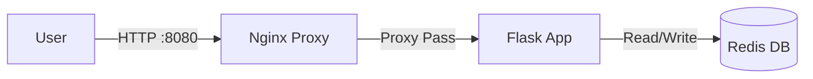

# 🐳 DevOps Dashboard

Un tableau de bord de monitoring simulé, construit avec une architecture **Microservices** conteneurisée.


## 🏗 Architecture

L'application est composée de 3 conteneurs orchestrés par Docker Compose :

1.  **Web App (Python/Flask)** : Le backend qui génère le tableau de bord HTML.
2.  **Redis** : Base de données en mémoire pour stocker le compteur de vues (persistance des données).
3.  **Nginx** : Reverse Proxy qui sert l'application (Front-Door).



## 🚀 Lancer le projet

### Prérequis
*   [Docker Desktop](https://www.docker.com/products/docker-desktop/) installé et lancé.

### Démarrage
1.  Aller dans le dossier :
    ```bash
    cd devops-dashboard
    ```
2.  Lancer les containers :
    ```bash
    docker-compose up --build -d
    ```
3.  Accéder au tableau de bord :
    👉 **http://localhost:8080**

## 🛑 Arrêt
```bash
docker-compose down
```
